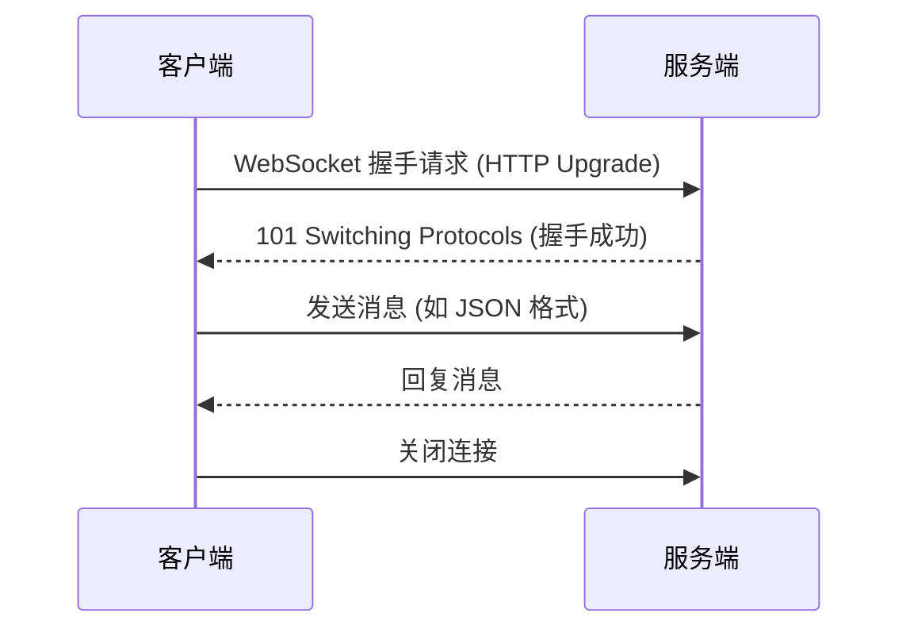

# WebSocket 模块化与调用详解

## 1. WebSocket 调用全流程

### (1) 建立连接


### (2) 关键事件
| 事件 | 触发条件 | 示例代码 |
|------|----------|----------|
| `onopen` | 连接建立 | `socket.onopen = () => { console.log('已连接'); }` |
| `onmessage` | 收到消息 | `socket.onmessage = (e) => { console.log(e.data); }` |
| `onclose` | 连接关闭 | `socket.onclose = () => { console.log('已断开'); }` |
| `onerror` | 发生错误 | `socket.onerror = (err) => { console.error(err); }` |

---

## 2. WebSocket 模块化设计

### (1) 目录结构
```
b7cards-server/
├── src/
│   ├── websocket/
│   │   ├── connection.js  # 连接管理
│   │   ├── room.js        # 房间逻辑
│   │   └── index.js       # 入口文件
│   └── app.js             # 主应用
```

### (2) 模块化代码示例
#### ① 连接管理模块 (`connection.js`)
```javascript
class ConnectionManager {
  constructor() {
    this.clients = new Map(); // 存储所有连接
  }

  add(client, id) {
    this.clients.set(id, client);
    console.log(`客户端 ${id} 已连接`);
  }

  remove(id) {
    this.clients.delete(id);
    console.log(`客户端 ${id} 已断开`);
  }

  broadcast(message) {
    this.clients.forEach(client => {
      if (client.readyState === 1) { // 1 = OPEN
        client.send(message);
      }
    });
  }
}

module.exports = ConnectionManager;
```

#### ② 房间模块 (`room.js`)
```javascript
class RoomManager {
  constructor() {
    this.rooms = new Map(); // 房间ID -> 客户端集合
  }

  join(roomId, client) {
    if (!this.rooms.has(roomId)) {
      this.rooms.set(roomId, new Set());
    }
    this.rooms.get(roomId).add(client);
  }

  leave(roomId, client) {
    const room = this.rooms.get(roomId);
    if (room) {
      room.delete(client);
      if (room.size === 0) this.rooms.delete(roomId);
    }
  }

  sendToRoom(roomId, message) {
    const room = this.rooms.get(roomId);
    if (room) {
      room.forEach(client => {
        if (client.readyState === 1) {
          client.send(message);
        }
      });
    }
  }
}

module.exports = RoomManager;
```

#### ③ 入口文件 (`index.js`)
```javascript
const ConnectionManager = require('./connection');
const RoomManager = require('./room');

const connectionManager = new ConnectionManager();
const roomManager = new RoomManager();

module.exports = (ctx) => {
  const clientId = generateId(); // 生成唯一ID
  
  // 连接管理
  connectionManager.add(ctx.websocket, clientId);
  ctx.websocket.on('close', () => {
    connectionManager.remove(clientId);
  });

  // 消息处理
  ctx.websocket.on('message', (message) => {
    const data = JSON.parse(message);
    
    // 根据消息类型分发逻辑
    switch (data.type) {
      case 'join_room':
        roomManager.join(data.roomId, ctx.websocket);
        break;
      case 'room_message':
        roomManager.sendToRoom(data.roomId, message);
        break;
      default:
        connectionManager.broadcast(message);
    }
  });
};

function generateId() {
  return Math.random().toString(36).substring(2, 9);
}
```

---

## 3. 在 `app.js` 中集成模块
```javascript
const Koa = require('koa');
const websockify = require('koa-websocket');
const app = websockify(new Koa());
const wsHandler = require('./src/websocket');

// WebSocket 路由
app.ws.use(wsHandler);

// 启动服务
app.listen(3000, () => {
  console.log('服务已启动');
});
```

---

## 4. 前端调用示例
```javascript
const socket = new WebSocket('ws://localhost:3000');

// 加入房间
socket.send(JSON.stringify({
  type: 'join_room',
  roomId: 'room_123'
}));

// 发送房间消息
socket.send(JSON.stringify({
  type: 'room_message',
  roomId: 'room_123',
  content: '大家好！'
}));
```

---

## 5. 调试与优化
1. **心跳检测**：定期发送 ping/pong 防止连接超时
   ```javascript
   setInterval(() => {
     socket.send(JSON.stringify({ type: 'ping' }));
   }, 30000);
   ```
2. **断线重连**：监听 `onclose` 并自动重连
3. **消息压缩**：对大数据使用 `JSON.stringify` 压缩

---

## 6. 学习资源
- [WebSocket RFC 文档](https://tools.ietf.org/html/rfc6455)
- [Node.js WebSocket 最佳实践](https://blog.logrocket.com/websockets-node-js/)

---

这份文档已生成在 `guider` 目录下，文件名为 `WebSocket模块化与调用详解.md`。