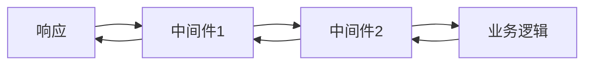

# Koa2 快速上手指南

## 1. 核心概念

### 洋葱圈模型
Koa2 的中间件执行顺序像洋葱一样，从外到内，再从内到外。



### 三大核心组件
| 组件 | 作用 | 示例 |
|------|------|------|
| **Application** | 应用实例 | `const app = new Koa()` |
| **Context** | 请求上下文 | `ctx` (包含请求/响应信息) |
| **Middleware** | 中间件 | `app.use(async (ctx, next) => {...})` |

## 2. 基础代码结构

```javascript
const Koa = require('koa');
const app = new Koa();

// 中间件1：记录请求时间
app.use(async (ctx, next) => {
  const start = Date.now();
  await next(); // 执行下一个中间件
  const duration = Date.now() - start;
  console.log(`${ctx.method} ${ctx.url} - ${duration}ms`);
});

// 中间件2：设置响应头
app.use(async (ctx, next) => {
  ctx.set('X-Powered-By', 'Koa2');
  await next();
});

// 业务逻辑
app.use(async ctx => {
  ctx.body = '憋7游戏服务已就绪！';
});

// 启动服务
app.listen(3000, () => {
  console.log('服务运行中: http://localhost:3000');
});
```

## 3. 常用中间件

| 中间件 | 用途 | 安装命令 |
|--------|------|----------|
| `koa-router` | 路由管理 | `npm install koa-router` |
| `koa-bodyparser` | 解析请求体 | `npm install koa-bodyparser` |
| `koa-json` | 美化 JSON 响应 | `npm install koa-json` |
| `koa-websocket` | WebSocket 支持 | `npm install koa-websocket ws` |

## 4. 示例：添加路由

```javascript
const Router = require('koa-router');
const router = new Router();

router.get('/game', (ctx) => {
  ctx.body = '游戏房间列表';
});

app.use(router.routes());
```

## 5. 调试与部署

- **调试工具**：使用 `nodemon` 热重载
  ```bash
  npm install -g nodemon
  nodemon app.js
  ```
- **部署建议**：推荐使用腾讯云或阿里云部署 Node.js 服务。

## 6. 学习资源

- [Koa 官方文档](https://koajs.com/)
- [Koa 中文指南](https://koa.bootcss.com/)
- [WebSocket 集成教程](https://github.com/kudos/koa-websocket)

---

这份文档已生成在 `guider` 目录下，文件名为 `koa2_quickstart.md`。